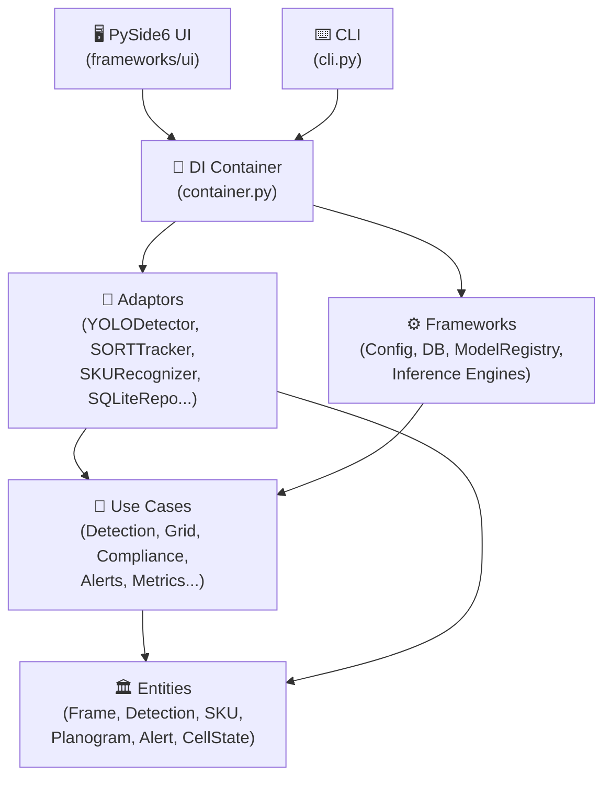
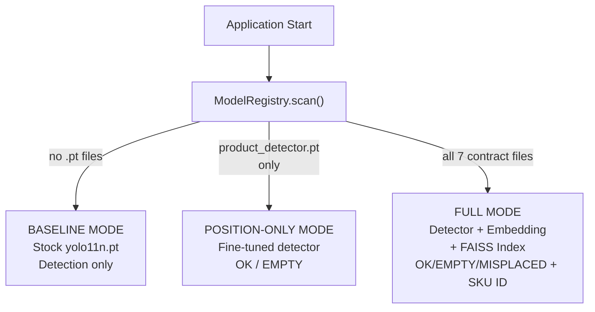
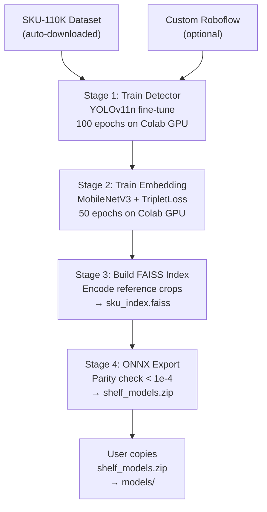
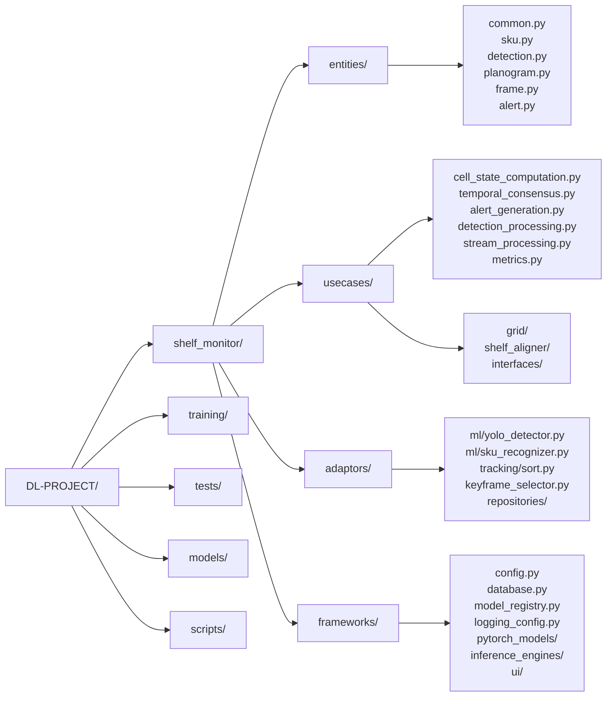
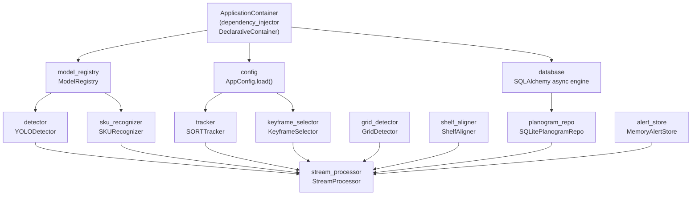
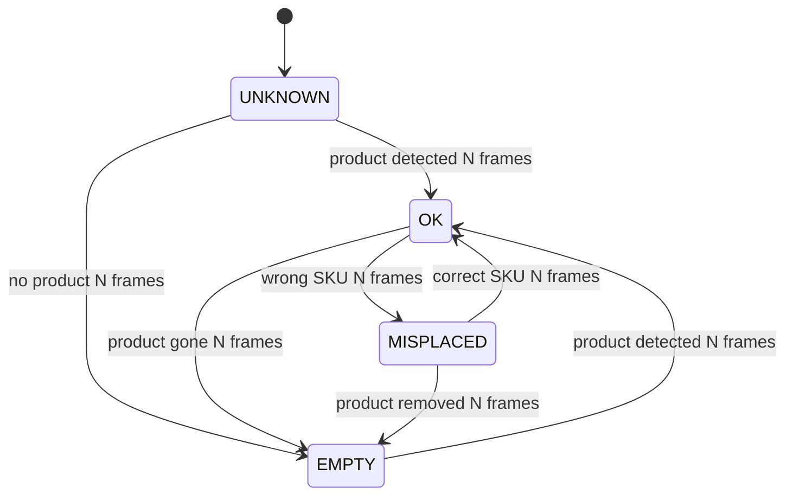

# System Architecture

## Overview

The Retail Shelf Monitoring System is built with **Clean Architecture** principles, separating business logic from infrastructure concerns. Data flows inward through the dependency rule — outer layers depend on inner layers, never the reverse.

---

## Layer Diagram



---

## Real-Time Processing Pipeline

```mermaid
flowchart LR
    VideoSource["📹 Video Source\n(file / webcam)"]
    Capture["CaptureThread\nOpenCV frame read"]
    Keyframe["KeyframeSelector\nDiff threshold filter"]
    Inference["InferenceThread\nYOLO + SORT + SKU"]
    Grid["GridDetector\nDBSCAN clustering"]
    Aligner["ShelfAligner\nHomography → shelf_id"]
    Compliance["CellStateComputation\nOK/EMPTY/MISPLACED"]
    Consensus["TemporalConsensus\nMin N consecutive frames"]
    Alerts["AlertGeneration\nOOS + Misplacement rules"]
    Store["AlertStore\nMemory / Redis"]
    UI2["UI Dashboard\nAnnotated frames + alerts"]

    VideoSource --> Capture
    Capture --> Keyframe
    Keyframe --> Inference
    Inference --> Grid
    Grid --> Aligner
    Aligner --> Compliance
    Compliance --> Consensus
    Consensus --> Alerts
    Alerts --> Store
    Store --> UI2
```



---

## Model Registry – Operating Modes



---

## Training Pipeline



---

## File Structure Detail



---

## Dependency Injection (container.py)



---

## UI Threading Model

```mermaid
sequenceDiagram
    participant CT as CaptureThread
    participant IT as InferenceThread
    participant AT as AlertAnalysisThread
    participant ALT as AlertThread
    participant MW as MainWindow (Qt)

    CT->>IT: frame (via QQueue, drop-oldest)
    IT->>MW: annotated_frame (signal)
    IT->>AT: cell_states (signal)
    AT->>ALT: potential_alerts (signal)
    ALT->>MW: alert_list (signal)
    MW->>MW: update_ui()
```

---

## Alert State Machine


